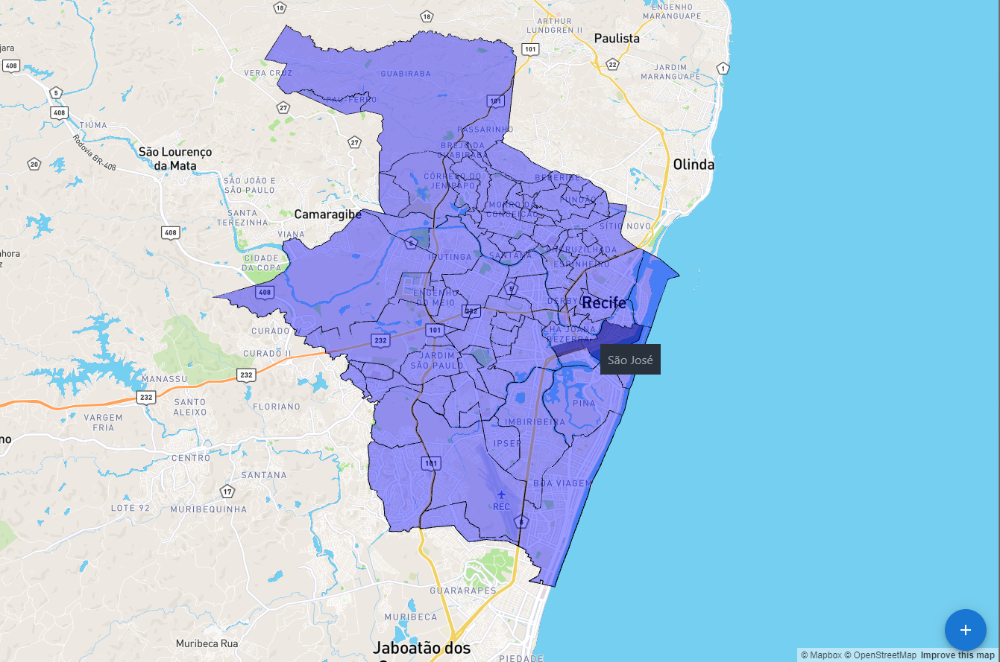
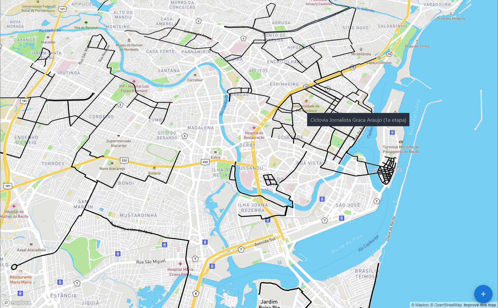

# RecifeMap

<!---Esses são exemplos. Veja https://shields.io para outras pessoas ou para personalizar este conjunto de escudos. Você pode querer incluir dependências, status do projeto e informações de licença aqui--->




> Conheça os bairros de Recife e suas ciclovias.

## 💻 Pré-requisitos

Antes de começar, verifique se você atendeu aos seguintes requisitos:
<!---Estes são apenas requisitos de exemplo. Adicionar, duplicar ou remover conforme necessário--->
* Você instalou a versão mais recente de `< React >`
* Você tem uma máquina `<Windows / Linux / Mac>`.
* Você leu `<https://github.com/RafaelTomas/Recife_Map/blob/main/README.md>`.

## 🚀 Instalando RecifeMap

Para instalar o RecifeMap, siga estas etapas:

Windows/Linux/Mac:
```bash

# Clone este repositório
$ git clone git@github.com:RafaelTomas/Recife_Map.git

# Acesse a pasta do projeto no terminal/cmd
$ cd RecifeMap

# Instale as dependências
$ npm install

# Execute a aplicação em modo de desenvolvimento
$ npm run start
# O servidor inciará na porta:3000 - acesse http://localhost:3000
```
---
## ☕ Usando RecifeMap

### Visualizar os bairros da capital do nordeste

> Conheça os bairros de Recife e suas ciclovias.

### Selecione o modo Ciclovia


### Veja as ciclovias e seus respectivos nome


---
## 🤝 Desenvolvedor

Obrigado pela sua visita a esse projeto S2:

<table>
  <tr>
    <td align="center">
      <a href="#">
        <br>
        <sub>
          <b>Rafael Tomas</b>
        </sub>
      </a>
    </td>
  </tr>
</table>


## 📝 Licença

Esse projeto está sob licença. Veja o arquivo [LICENÇA](LICENSE.md) para mais detalhes.

[⬆ Voltar ao topo](#RecifeMap)<br>